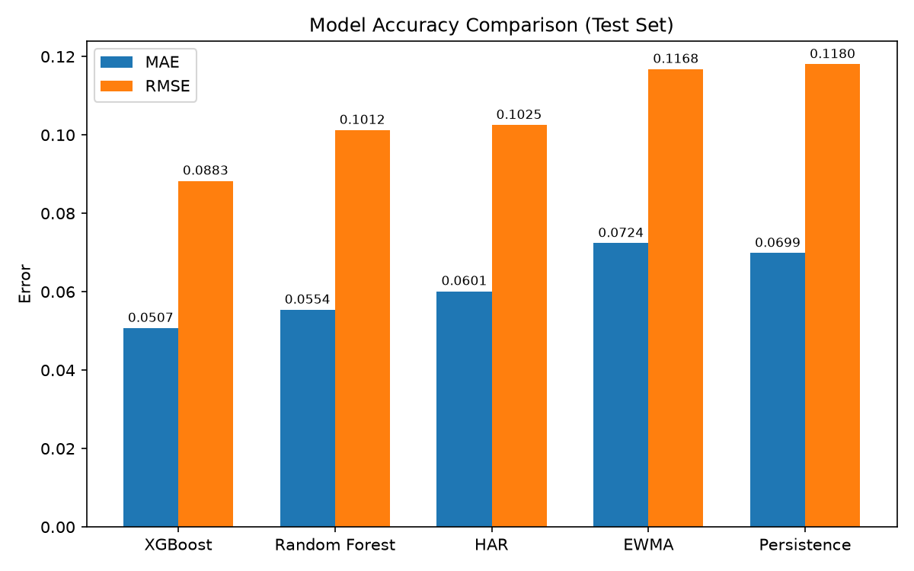

# SPY Volatility Forecasting

Forecasts SPY's 5-day-forward realized volatility using multiple models and compares them on unused data.

# Tree

```
.
├── data
│   ├── processed
│   │   ├── spy_features.csv
│   │   └── spy_features.parquet
│   └── raw
│       ├── spy_daily.csv
│       ├── spy_daily.parquet
│       ├── vix_daily.csv
│       └── vix_daily.parquet
├── results
│   ├── forecasts
│   │   ├── ewma_forecasts.csv
│   │   ├── har_forecasts.csv
│   │   ├── persistence_forecasts.csv
│   │   ├── random_forest_forecasts.csv
│   │   └── xgboost_forecasts.csv
│   ├── model_comparison.png
│   └── model_metrics.csv
├── src
│   ├── models
│   │   ├── __init__.py
│   │   ├── baseline.py
│   │   ├── ewma.py
│   │   ├── har.py
│   │   ├── random_forest.py
│   │   └── xgboost_model.py
│   ├── __init__.py
│   ├── download_data.py
│   ├── evaluation.py
│   ├── feature_engineering.py
│   └── visualize.py
├── README.md
└── requirements.txt
```

## Methods

Data is split chronologically (70/15/15, train/val/test) so no model ever trains on future data, and there were no iterations after seeing test for the first time on each model.

## Models

- Persistence - Naive baseline that predicts current volatility repeats
- EWMA - Exponentially-weighted volatility (λ = 0.94)
- HAR - Linear regression on 5/20/60-day realized vol
- Random Forest - Decision trees using 21 engineered features
- XGBoost - Gradient-boosted trees on the same 21 features

## Results

| Model         | MAE    | RMSE   |
|---------------|--------|--------|
| XGBoost       | 0.0507 | 0.0883 |
| Random Forest | 0.0554 | 0.1012 |
| HAR           | 0.0601 | 0.1025 |
| EWMA          | 0.0724 | 0.1168 |
| Persistence   | 0.0699 | 0.1180 |



XGBoost wins on both metrics, followed Random Forest and HAR which all beat EWMA and Persistence by far.

## Takeaways

Despite huge percent improvements on accuracy (27% MAE reduction from Persistence to XGBoost), there were only minimal actual improvements in accuracy (1.92%). This project highlights that although it is possible to be more accurate on metrics with ML or other more complex models, the real benefit to them might not be large. In a real trading system, a volatility predictor that gets you 1.92% closer to real volatility might not be worth the complexity/delay it adds.